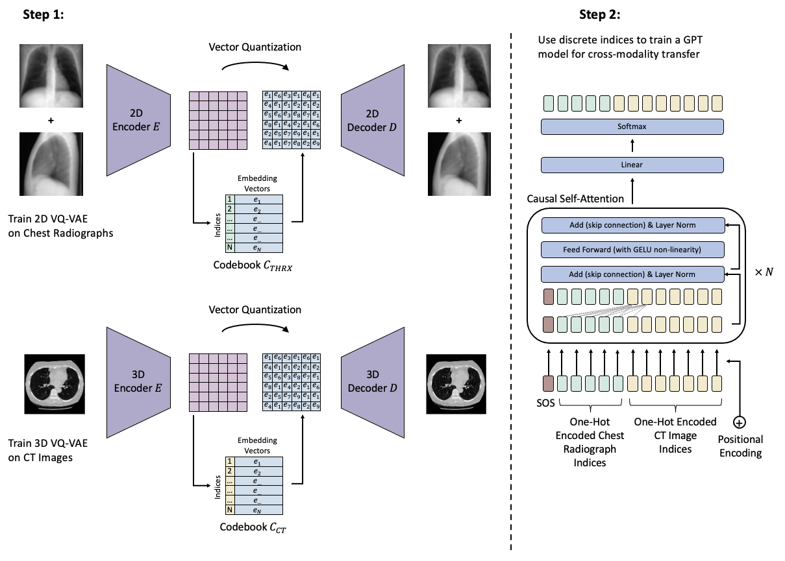

Transformers for CT Reconstruction From Monoplanar and Biplanar Radiographs
=========================

This repository contains the code to our corresponding publication "Transformers for CT Reconstruction From Monoplanar and Biplanar Radiographs"

- [Springer Proceedings](https://link.springer.com/chapter/10.1007/978-3-031-44689-4_1)
- [Arxiv Preprint](https://arxiv.org/abs/2305.06965)




# System Requirements
This code has been tested on Ubuntu 20.04 and an NVIDIA Quadro RTX A6000 GPU. Furthermore it was developed using Python v3.8.

# Setup

In order to run this model, please download the LIDC-IDRI dataset (https://wiki.cancerimagingarchive.net/pages/viewpage.action?pageId=1966254).

Additionally, create a virtual environment (e.g. with conda):
````
conda create -n ct_reconstruction python=3.8
````
and run 
```
conda activate ct_reconstruction
```
followed by
```
pip install -r requirements.txt
```
to download and install the required dependencies. 

# Preprocessing

Next, before we run the code we have to preprocess the CT images and convert them from DICOM to .npy files. To do so, run
```
python preprocessing/preprocess.py --input_path <PATH_TO_LIDC_DATASET> --path_output <PATH_TO_PREPROCESSED_DATA>
```

where <PATH_TO_LIDC_DATASET> points to the folder containing all LIDC-IDRI DICOM folders and <PATH_TO_PREPROCESSED_DATA> points to the desired output location.

# Training the VQ-GAN models

Once everything is set up, we can start training our models. The first step is to train the VQ-GAN models. Note that this will be done in two steps. First, we train a normal VQ-VAE (i.e., the VQ-GAN without the discriminator) for a few epochs and subsequently train the VQ-GAN.

To train the 2D model, run the following commands;
To train the VQ-VAE, run:

```
python vqgan/train.py --mode 2D --data-dir <PATH_TO_PREPROCESSED_DATA>
```
After training has finished, copy the path to the best checkpoint (e.g., ".../runs/2023_10_16_180438/epoch=XXX-step=XXX.ckpt") 
and train the VQ-GAN model using:
```
python vqgan/train.py --mode 2D --data-dir <PATH_TO_PREPROCESSED_DATA> --best-vq-vae-ckpt <PATH_TO_BEST_VQ_VAE_CHECKPOINT>
```

The same steps can be repeated to train the 3D model, i.e.:
```
python vqgan/train.py --mode 3D --data-dir <PATH_TO_PREPROCESSED_DATA>
```
and 
```
python vqgan/train.py --mode 3D --data-dir <PATH_TO_PREPROCESSED_DATA> --best-vq-vae-ckpt <PATH_TO_BEST_VQ_VAE_CHECKPOINT>
```

Before we continue with training the GPT model, and in order to speed up the training process, we first convert all images (the 3D CT images and the 2D digitally reconstructed radiographs) into their discrete latent indices.
This can be done by navigating to ./vqgan/evaluate.ipynb and running the jupyter notebook. 
NOTE: The Jupyter-Notebook has to be run three times with different settings. Please check out the second cell detailing the exact settings required in the jupyter-notebook itself.

# Training the GPT model
To train the GPT model, run the following command:
```
python gptnano/train.py --num-codebook-vectors 8192 --checkpoint-path-3d-vqgan <PATH_TO_BEST_3D-VQ-GAN-CHECKPOINT> --checkpoint-path-2d-vqgan <PATH_TO_BEST_2D-VQ-GAN-CHECKPOINT> --path-to-preprocessed-data <PATH_TO_PREPROCESSED_DATA> --path-to-data-indices <PATH_TO_DATA_INDICES>
```
where <PATH_TO_BEST_3D-VQ-GAN-CHECKPOINT> and <PATH_TO_BEST_2D-VQ-GAN-CHECKPOINT> point to the best checkpoints of the 2D and 3D VQ-GAN models (the same ones used in ./vqgan/evaluate.ipynb) and <PATH_TO_DATA_INDICES> points to the folder containing the pre-extracted latent codebook indices of the images (this is set in the ./vqgan/evaluate.ipynb notebook as STORAGE_DIR)

Once the training has finished, we can synthesize the CT images. To do so, navigate to ./gptnano/evaluate.ipynb and set the necessary paths.


# Citation
To cite our work, please use
```bibtex
@inproceedings{khader_transformers_2023,
	address = {Cham},
	title = {Transformers for {CT} {Reconstruction} from {Monoplanar} and {Biplanar} {Radiographs}},
	isbn = {978-3-031-44689-4},
	booktitle = {Simulation and {Synthesis} in {Medical} {Imaging}},
	publisher = {Springer Nature Switzerland},
	author = {Khader, Firas and Müller-Franzes, Gustav and Han, Tianyu and Nebelung, Sven and Kuhl, Christiane and Stegmaier, Johannes and Truhn, Daniel},
	year = {2023},
	pages = {1--10},
}
```


